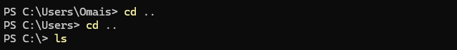
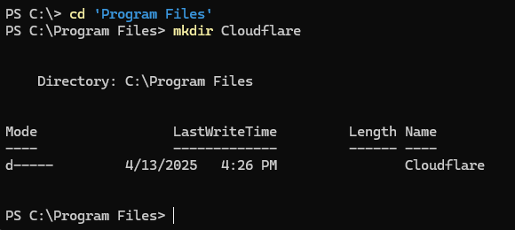
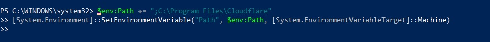
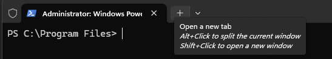
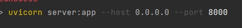

---

# 🌐 Deploy Local Server with Cloudflare Tunnel

This guide helps you set up a public-facing URL for your local Python web server (like FastAPI or Flask) using `cloudflare`.

---

## ✅ Step 1: Open PowerShell as Administrator

- Press `Windows + X`  
- Click on **Terminal (Admin)** or **Windows PowerShell (Admin)**

---

## ✅ Step 2: Download `cloudflared.exe`

Run the following command in the terminal:

```powershell
Invoke-WebRequest -Uri https://github.com/cloudflare/cloudflared/releases/latest/download/cloudflared-windows-amd64.exe -OutFile cloudflared.exe
```

This will download the latest `cloudflared` executable to your current directory.

---

## ✅ Step 3: Create a Folder for Cloudflare

Make a new folder inside `C:\Program Files`:

```powershell
mkdir "C:\Program Files\Cloudflare"
```

You can also manually create this folder via File Explorer:

> 📸 Example:  
>   
> 

---

## ✅ Step 4: Move and Configure `cloudflared`

In the Terminal make sure you are in the Users/(yourpcname) folder and then run the commands below:

Move the executable to the new Cloudflare folder:

```powershell
Move-Item -Path .\cloudflared.exe -Destination "C:\Program Files\Cloudflare\cloudflared.exe"
```

Then, add this folder to your system's PATH environment variable:

```powershell
$env:Path += ";C:\Program Files\Cloudflare"
[System.Environment]::SetEnvironmentVariable("Path", $env:Path, [System.EnvironmentVariableTarget]::Machine)
```

> 🧠 Tip: You can check manually if the `.exe` was moved to `C:\Program Files\Cloudflare`.  
> If it isn’t there, re-run the **Move-Item** command.

> 📸 Example:  
> 

---

## ✅ Step 5: Run the Cloudflare Tunnel

Open a **new PowerShell window** to ensure the updated PATH is recognized:

> 📸 Example:  
> 

Now run the tunnel command:

```powershell
cloudflared tunnel --url http://localhost:8000
```

---

## ✅ Step 6: Start Your Local Server

Make sure your `server.py` or FastAPI/Flask app is running:

```bash
uvicorn server:app --reload
```

You should now be able to access it:

- **Locally:** [http://localhost:8000](http://localhost:8000)  
- **Remotely:** Cloudflare will generate a public URL like `https://random-name.trycloudflare.com`

> 📸 Example:  
> 

---

## ✅ API Access

You can send requests to:

```
https://your-cloudflare-url.com/analyze
```

This allows remote systems or clients to interact with your local Python API seamlessly.

---
