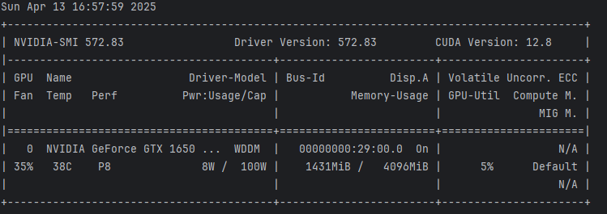

---

# 🚀 Run & Host Your AI Model with PyTorch and Cloudflare

This guide walks you through installing PyTorch, downloading your AI model, starting the server, and hosting it online using Cloudflare's free tunnel.

---

## ✅ Step 1: Install PyTorch (CUDA 12.4)

Use the following command to install **PyTorch**, **Torchvision**, and **Torchaudio** with CUDA 12.4 support:

Check your CUDA version by opening the terminal and running (Works only for NVIDIA-GPUS):
```powershell 
nvidia-smi
```
>

Visit https://pytorch.org/ for the latest command for your CUDA Version. 
The command shall look like this.


```bash
pip3 install torch torchvision torchaudio --index-url https://download.pytorch.org/whl/cu124
```

> 💡 This ensures GPU acceleration works properly on systems with CUDA 12.4.

---

## ✅ Step 2: Start the Server

⚠️ WARNING: This process will download and save a large AI model.
It can consume significant system resources (RAM, disk, GPU) and may slow down or freeze your PC during execution.
Make sure to save all your work beforehand and ensure you have an NVIDIA GPU available.

```terminal
uvicorn server:app --host 0.0.0.0 --port 8000
```
To shut down the server press Ctrl+c.

> 🧠 Ensure `server.py` contains proper routing to serve your model, e.g., `/analyze` endpoint for inference.
---

## ✅ Step 3: Host Your Model Using Cloudflare

Use **Cloudflare Tunnel** to expose your local server to the internet:

```bash
cloudflared tunnel --url http://localhost:8000
```

> This will provide a free, secure public URL like `https://your-model-name.trycloudflare.com`.

---

## ✅ Accessing the API

You can now test the model by sending a request to:

```
https://your-cloudflare-url.com/analyze
```

Use tools like `curl`, Postman, or code to make API calls.

---

## 📚 Need More Help?

Refer to the official **[Cloudflare Tunnel documentation](https://developers.cloudflare.com/cloudflare-one/connections/connect-apps/install-and-setup/installation/)** for detailed setup, custom domains, and security features.

---